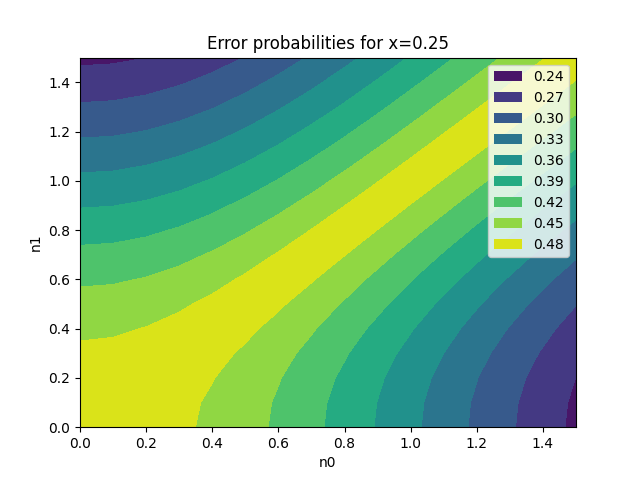
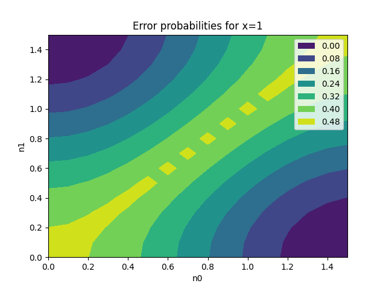
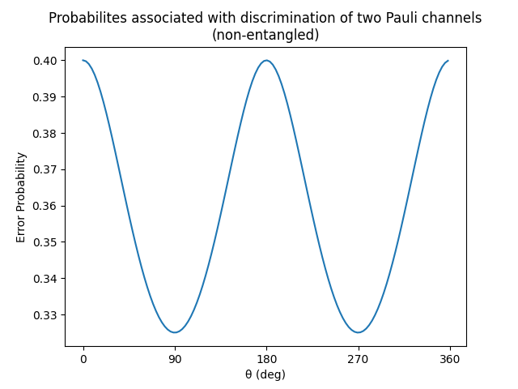

### Quantum channel discrimination

**Goal**: To find optimal input state in order to discrimate amplitude damping and pauli channels with maximum success.

Files:
- non_optimal_discrimination.py: Distinguishes depolarizing channel from identity for a qubit and 
qutrit system, along with a depolarizing factor. Doesn't use a choi jamiolkowski matrix, hence the
name non-optimal.

- qcd_cj_matrix.py: Uses CJ matrix, and also computes the graph for different p values and probabilities.
Adapted code from https://github.com/vsiddhu/SDP-Quantum-OR/blob/main/Notebook%203%20-%20Quantum%20Channel%20Discrimination.ipynb

- discrim_amplitude_damping.py: Distinguishes two amplitude damping channels. Calculates the 
hamiltonian, unitary matrix, and finally density matrix to get the probabilities. Formulas and theory
from: https://arxiv.org/abs/2009.01000

- discrim_pauli_channels.py: Distinguishes two pauli channels, using a non-entangled state.
    Formulas and theory from: https://arxiv.org/pdf/quant-ph/0506072.pdf (see Section IV)

### Results

1. For Amplitude Damping Channel, there are 2 cases for achieving the optimal input state:

Case 1: γ >= 1/√2: We always obtain x=1 as the optimal input state (with lowest error probability). This can be easily seen from the contour plots below:

Case 2: γ < 1/√2: The optimal input state x ranges from 0.6 - 0.8. An example of a plot between x and η₁ with η₀ = 1.1 constant is given below:

2. For Pauli Channels, we obtain two optimal input states, at π/2 and 3π/2, which give the lowest error probabilities. This is seen in the plot below:

### Credits

I'd like to thank the authors of the papers mentioned above, along with my professor, Dr. Prabhu Tej J,
and my group members, Anagha and Dhanush, for their assistance in this project.
